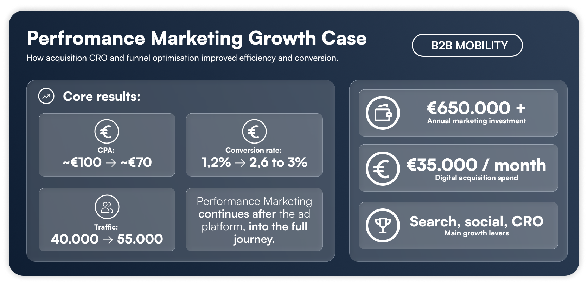

# Performance marketing growth case
How I connected paid acquisition, conversion optimisation, segmentation and lifecycle marketing to improve customer growth.

  

## Overview
This case is based on my work, a digital mobility platform for entrepreneurs and businesses. My responsibility went beyond managing paid media. I worked across the customer acquisition journey, including paid acquisition, website optimisation, CRO, segmentation, CRM and onboarding. The main growth challenge was straightforward:

_How do we acquire more customers while keeping acquisition cost under control?_

That meant looking beyond individual channel metrics and understanding how the complete funnel performed:

Traffic → Conversion → Onboarding → Customer

During this period, website conversion increased from approximately 1.2% to 2.6%, while CPA moved from approximately €100 toward €75. Traffic also grew from approximately 40.000 to 50.000 monthly visits, with peak acquisition periods reaching approximately 1,700 new customers per month. This repository breaks down how I approached that growth problem, the decisions behind it and how acquisition, conversion and customer journey optimisation worked together.

### What this case covers
+ Performance marketing
+ Paid Search
+ Paid Social
+ Customer segmentation
+ Conversion rate optimisation
+ Website and customer journey
+ CRM and onboarding
+ Funnel measurement
+ Budget optimisation
+ Growth experimentation

### Data & confidentially
The business contect and high-level results in this are based on my real experience. They are an indication to the actuall numbers. Where detailed campaign, customer or financial data can't be shared, I use synthetic data based on the same type of growth problem and operating model.

_No confidential customer-level of commercially sensitive company data is included._
